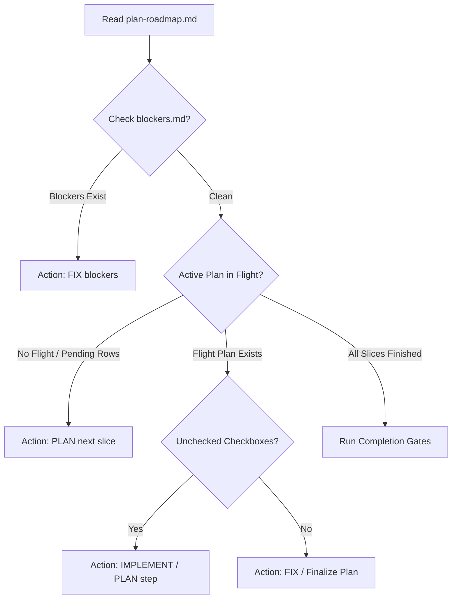

# MCO Autonomous Loop Details

**Last Updated:** 2026-07-14

This document provides a detailed reference for the MCO-backed autonomous roadmap execution loop in this repository. Use this guide to understand how it operates, how to monitor it, and how to troubleshoot or interact with it.

---

## 1. Loop Orchestration and Core Script

The entry point for the loop is the [agent-loop](file:///Users/jonathan/shakedown/agent-loop) script in the repository root. This script executes the [main](file:///Users/jonathan/shakedown/scripts/mco_loop.py#L884) function of [mco_loop.py](file:///Users/jonathan/shakedown/scripts/mco_loop.py):

* **Configuration**: Defined in [agent-loop.toml](file:///Users/jonathan/shakedown/agent-loop.toml). Specifies loop timeouts, pauses, cooldowns, and the executor list.
* **Secrets**: Loaded from the path configured under `[loop].env_file` (e.g. `~/hn-qotd/evals/.env`). Only pre-approved API keys (`XAI_API_KEY`, `OPENROUTER_API_KEY`) are permitted to load to prevent credential leakage.

---

## 2. Dynamic Workflow Lifecycle

In each loop iteration, the supervisor parses repository state and files to classify the next action:



* **Roadmap Parsing**: [parse_roadmap](file:///Users/jonathan/shakedown/scripts/mco_loop.py#L180) extracts row statuses from [plan-roadmap.md](file:///Users/jonathan/shakedown/docs/superpowers/plans/plan-roadmap.md).
* **Blocker Check**: [read_blockers](file:///Users/jonathan/shakedown/scripts/mco_loop.py#L208) reads [.agent/blockers.md](file:///Users/jonathan/shakedown/.agent/blockers.md). Any line matching `- BLOCK:` halts normal execution and forces the supervisor into a `FIX` role to resolve it.
* **Step Selection**: [determine_next_action](file:///Users/jonathan/shakedown/scripts/mco_loop.py#L235) finds the first unchecked checkbox (`- [ ]`) in the active plan. If the description matches planning words (e.g. `write spec` or `reserve literary`), the action kind becomes `PLAN`; otherwise, it is `IMPLEMENT`.

Before ordinary roadmap selection runs, [canonical_action](file:///Users/jonathan/shakedown/scripts/mco_loop.py#L444) applies three reconciliation fences in fixed order:

1. invalid structured branch blockers become a `FIX` action;
2. untracked planning artifacts under `docs/superpowers/plans/` or `docs/superpowers/specs/` become a `PLAN` action;
3. unresolved unmerged-branch inventory becomes a `PLAN` action.

Only when all three fences are clear does the loop dispatch the next normal roadmap step.

---

## 3. Cooldown and Failover Mechanics

To maintain continuous progression without getting stuck on rate limits or stubborn errors, the loop manages executor pools:

* **Executor Pools**: Configured under `[[planning]]` and `[[implementation]]` sections in [agent-loop.toml](file:///Users/jonathan/shakedown/agent-loop.toml) using prioritized failover lists.
* **State Preservation**: Non-secret supervisor state is recorded in [.agent/mco-loop-state.json](file:///Users/jonathan/shakedown/.agent/mco-loop-state.json).
* **Rate Limits / Cooldowns**: If an executor fails with transient errors or rate limits, its quota group is placed on cooldown (`cooldown_seconds` defaults to `3600` seconds). The loop selects, waits for trusted availability, or terminates exhaustion via `select_executor` in `scripts/mco_loop.py`.

Result classification is supervisor-owned. Observable repository progress wins
over words in provider output, so a provider editing rate-limit tests is not
mistaken for a rate-limited backend. New blocker lines are non-substantive;
Python supervisor timeout `124`, backend failures, and zero-progress results
are substantive failures.

Substantive attempts are recorded under a stable key derived from the canonical
roadmap action before recovery or governor rewrites. An executor is attempted
only once for that unchanged action. Claude and Codex availability failures are
retried after their cooldown; Pi fallbacks remain last-resort. The loop
intentionally does not wait for a Pi cooldown after the trusted and available
fallback chain is exhausted.

### Free OpenRouter Fallback Pool

Six Pi-backed free OpenRouter models act as last-resort implementation
fallbacks, in capability-and-availability priority order: NVIDIA Nemotron 3
Ultra (550B flagship), OpenAI gpt-oss-120b, NVIDIA Nemotron 3 Super (120B),
Tencent Hy3, Poolside Laguna M.1, and Qwen3 Coder last (strongest coder of
the set but chronically throttled upstream). All six were verified live with
a real tool-call task through `pi` on 2026-07-12. They share the
`openrouter` quota group because they share one API key and one free-tier
daily request cap — one throttle cools the whole group, which is the correct
blast radius.

Unresponsive free models cannot block the loop:

* upstream throttles (`429:`, `rate-limited`) classify as `rate_limit`
  availability failures with a group cooldown the loop never waits on;
* silent empty completions (Pi exhausts its internal retries and exits `0`
  with no output) leave the repository unchanged, classify as `no_progress`,
  and skip that executor for the unchanged action;
* true hangs are bounded by MCO's 900 s stall timeout (`backend_failure`)
  and the 5-hour Python supervisor cap (`supervisor_timeout`).

Grok and all xAI configuration were removed on 2026-07-12 because the xAI
team has no credits and none will be purchased; `XAI_API_KEY` is no longer
allowlisted, and the operator may delete the stale key from the git-ignored
repo-root `.env`. Grok may return only with restored credits and a fresh
verification run.

### Machine-Local Pi Configuration

Two of the six fallbacks (`nvidia/nemotron-3-super-120b-a12b:free`,
`qwen/qwen3-coder:free`) are not in `pi`'s built-in model registry. For
unknown model IDs, `pi` requests a 262 000-token completion budget that the
free endpoints reject with a 400 output-budget error. The workaround is a
machine-local `~/.pi/agent/models.json` defining both models with a capped
`maxTokens`; a fresh machine needs exactly:

```json
{
  "providers": {
    "openrouter": {
      "models": [
        {
          "id": "qwen/qwen3-coder:free",
          "name": "Qwen: Qwen3 Coder 480B A35B (free)",
          "contextWindow": 262000,
          "maxTokens": 32768,
          "input": ["text"]
        },
        {
          "id": "nvidia/nemotron-3-super-120b-a12b:free",
          "name": "NVIDIA: Nemotron 3 Super (free)",
          "contextWindow": 262000,
          "maxTokens": 32768,
          "input": ["text"]
        }
      ]
    }
  }
}
```

The supervisor prints a startup warning (`pi_models_config_warning`) when
either definition is missing. It also warns (`pi_auth_shadow_warning`) when
`~/.pi/agent/auth.json` contains a stored `openrouter` credential, because
`pi` silently prefers stored credentials over the loop's exported
`OPENROUTER_API_KEY` — the exact failure that once produced
`401: User not found` from every OpenRouter run. Any interactive `pi` login
can reintroduce that entry; neither warning blocks execution, and the
supervisor never edits either file.

---

## 4. Execution Mode and Git Commits

For each action, the loop builds a handoff prompt in [.agent/mco-current-prompt.md](file:///Users/jonathan/shakedown/.agent/mco-current-prompt.md) and invokes the MCO command:

* **MCO Invocation**: Commands run with `--execution-mode yolo` to allow autonomous tool calling.
* **Session Isolation**: Claude shims use `--no-session-persistence`; project-local Pi shims use `--no-session`. Antigravity is excluded from automatic routing because the installed CLI has no verified stateless execution mode.
* **Explicit Pi Tooling**: Every Pi shim passes `--tools read,bash,edit,write` so write capability is deliberate configuration, not an accident of `pi` defaults (MCO's built-in `pi` adapter runs read-only, which is why the project owns its shims).
* **Commit Guidelines**: Upon completing a step and passing its evidence gate, the agent must commit changes and push.
* **Provenance Trailers**: Every commit must end with a blank line followed by standard trailers identifying the agent executor:
  ```git
  Agent: <name>
  Model: <display_model>
  Harness: MCO 0.10.8
  Co-authored-by: <coauthor_name> <coauthor_email>
  ```

---

## 5. Architectural Review (Governor Mode)

Running `./agent-loop --govern` executes a read-only review on the governor tier — the first available `[[escalation]]` executor from `agent-loop.toml` (gpt-5.6-terra, then Opus), falling back to the planning pool. Claude Fable is not used; it stays outside all automatic and governor routing. The review analyzes the workspace and writes a directive to [.agent/fable-directive.md](file:///Users/jonathan/shakedown/.agent/fable-directive.md) with a leading verdict line:
* `VERDICT: CONTINUE` (sound plan)
* `VERDICT: FIX` (names a bounded repair)
* `VERDICT: REDIRECT` (amend existing specs or plans)
* `VERDICT: STOP` (halt for safety or authority)

## 5a. Blocker Escalation

Blockers tagged `- BLOCK[plan]:` in `.agent/blockers.md` route to the planning pool (`ActionKind.PLAN`) instead of the fix path, so planner-only halts are amended by planning models rather than re-recorded by implementation models. Untagged `- BLOCK:` lines keep the existing fix routing.

Structured branch-reconciliation blockers are a stricter planner-only subset. Their grammar is:

```text
- BLOCK[plan]: branch=<branch>; head=<40-hex sha>; base=<40-hex sha>; request=<review|integrate|supersede>; detail=<free text>
```

Only lines with the exact `branch=...; head=...; base=...; request=...; detail=...` field set are parsed as structured blockers. The supervisor validates the branch head with `git rev-parse` and the recorded merge base with `git merge-base <branch> main`. A malformed line, unsupported `request`, or mismatched head/base is not treated as planning work; it becomes an immediate `FIX` action so the operator-visible blocker context cannot silently drift.

The supervisor also tracks blocker persistence in `.agent/mco-loop-state.json` (`blocker_escalation`): after `BLOCKER_ESCALATION_THRESHOLD` (3) consecutive substantive invocations that leave the identical blocker set in place, the next iteration is forced to an escalated planning amendment on the `[[escalation]]` tier. Availability failures (rate limits, transient errors, supervisor timeouts) do not advance the counter. Exactly one escalated attempt is allowed per blocker signature; if the same blockers survive it, the loop exits `6` and asks for an operator decision.

## 5b. Branch Disposition Ledger and Artifact Fence

Unmerged local branches are tracked in [.agent/branch-dispositions.toml](file:///Users/jonathan/shakedown/.agent/branch-dispositions.toml). The ledger is intentionally committed even though the rest of `.agent/` remains runtime state. Each entry records:

* `head`: required 40-character commit SHA for the reviewed branch tip.
* `disposition`: one of `review`, `preserve`, `superseded`, or `integrated`.
* `reason`: non-empty operator-readable evidence for that disposition.

The loop inventories local heads with `git for-each-ref`, ignores only branches already merged into `main`, and compares every remaining branch against the ledger. It routes to the planning pool when any unmerged branch is missing from the ledger, still marked `review`, has a ledger/head mismatch, or exists in the ledger but no longer exists locally. This is an audit fence, not a merge assistant: branch deletion, rebasing, or merging are never performed automatically.

Planning artifacts have a parallel fence. Any non-ignored untracked file under `docs/superpowers/plans/` or `docs/superpowers/specs/` becomes a planner action until it is either committed intentionally or removed intentionally. Ignored runtime files such as `.agent/mco-loop-state.json` are excluded.

Failed planning actions remain planning work. [apply_failure_action](file:///Users/jonathan/shakedown/scripts/mco_loop.py#L1472) now preserves `ActionKind.PLAN` after `backend_failure` and `no_progress` outcomes; only ordinary implementation/fix actions are rewritten into bounded recovery `FIX` work.

---

## 6. How to Run, Monitor, and Stop

### Run in Background Log Mode
To run persistently and output log traces in real time, launch using unbuffered Python stdout:
```bash
PYTHONUNBUFFERED=1 ./agent-loop > .agent/loop.log 2>&1 &
```

### Tail the Logs
```bash
tail -f .agent/loop.log
```

### Inspect the Current Actions / Cooldowns
* Check status: `./agent-loop --status`
* Dry run (inspect next step/model selection): `./agent-loop --dry-run`
* Check supervisor state: `cat .agent/mco-loop-state.json`

### Safe Operator Reconciliation Workflow

When the loop reports reconciliation work, use this order:

1. Inspect the cited branch or artifact state without mutating history.
2. Record or update the terminal branch disposition in `.agent/branch-dispositions.toml`, or fix the structured blocker line in `.agent/blockers.md`.
3. Commit the documentation/ledger change with the required provenance trailers.
4. Run `./agent-loop --dry-run` and confirm the next action is the expected planner or roadmap action.

Do not delete a branch merely to satisfy inventory, and do not treat a stale ledger head as implicit approval to merge or discard work. The ledger is the durable decision record; the dry run is the confirmation that the loop now agrees with that record.

### Exit Statuses

| Status | Meaning |
|---|---|
| `0` | Successful invocation, completed roadmap, status, or dry run |
| `1` | `--once` invocation returned a non-success outcome |
| `2` | Setup, configuration, or MCO availability failure |
| `3` | `--once` found no executor available while a trusted transient cooldown remains retryable |
| `4` | Explicit Fable governor stop |
| `5` | Substantive executor chain exhausted for the unchanged action, or no governor-tier executor available for `--govern` |
| `6` | Escalated planning attempt already ran once and the same blocker persists; operator decision required |
| `124` | Explicit governor invocation reached the Python supervisor timeout |
| `130` | Operator interrupt |

On exit `5`, the loop prints `agent-loop: exhausted` to stderr and persists a
structured, secret-free diagnostic in `.agent/mco-loop-state.json`. The record
includes the canonical action, substantive attempts, active cooldowns, and
configured executors. Background runs capture the final line in
`.agent/loop.log`.

### Stopping Safely
* **Manual Interrupt**: Press `Ctrl+C` during the 5-second sleep window between steps to cleanly terminate the script.
* **Deferred Stop**: Write `- BLOCK: manual pause` to [.agent/blockers.md](file:///Users/jonathan/shakedown/.agent/blockers.md). The loop will cleanly finish the current step and pause before executing the next.
