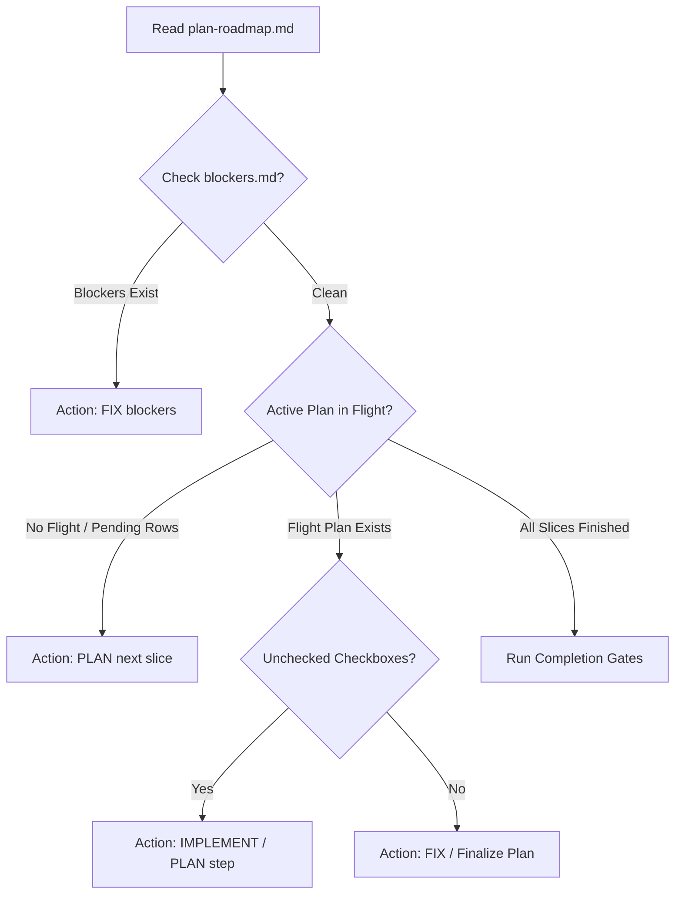

# MCO Autonomous Loop Details

**Last Updated:** 2026-07-12

This document provides a detailed reference for the MCO-backed autonomous roadmap execution loop in this repository. Use this guide to understand how it operates, how to monitor it, and how to troubleshoot or interact with it.

---

## 1. Loop Orchestration and Core Script

The entry point for the loop is the [agent-loop](file:///Users/jonathan/shakedown/agent-loop) script in the repository root. This script executes the [main](file:///Users/jonathan/shakedown/scripts/mco_loop.py#L884) function of [mco_loop.py](file:///Users/jonathan/shakedown/scripts/mco_loop.py):

* **Configuration**: Defined in [agent-loop.toml](file:///Users/jonathan/shakedown/agent-loop.toml). Specifies loop timeouts, pauses, cooldowns, and the executor list.
* **Secrets**: Loaded from the path configured under `[loop].env_file` (e.g. `~/hn-qotd/evals/.env`). Only pre-approved API keys (`XAI_API_KEY`, `OPENROUTER_API_KEY`) are permitted to load to prevent credential leakage.

---

## 2. Dynamic Workflow Lifecycle

In each loop iteration, the supervisor parses repository state and files to classify the next action:



* **Roadmap Parsing**: [parse_roadmap](file:///Users/jonathan/shakedown/scripts/mco_loop.py#L180) extracts row statuses from [plan-roadmap.md](file:///Users/jonathan/shakedown/docs/superpowers/plans/plan-roadmap.md).
* **Blocker Check**: [read_blockers](file:///Users/jonathan/shakedown/scripts/mco_loop.py#L208) reads [.agent/blockers.md](file:///Users/jonathan/shakedown/.agent/blockers.md). Any line matching `- BLOCK:` halts normal execution and forces the supervisor into a `FIX` role to resolve it.
* **Step Selection**: [determine_next_action](file:///Users/jonathan/shakedown/scripts/mco_loop.py#L235) finds the first unchecked checkbox (`- [ ]`) in the active plan. If the description matches planning words (e.g. `write spec` or `reserve literary`), the action kind becomes `PLAN`; otherwise, it is `IMPLEMENT`.

---

## 3. Cooldown and Failover Mechanics

To maintain continuous progression without getting stuck on rate limits or stubborn errors, the loop manages executor pools:

* **Executor Pools**: Configured under `[[planning]]` and `[[implementation]]` sections in [agent-loop.toml](file:///Users/jonathan/shakedown/agent-loop.toml) using prioritized failover lists.
* **State Preservation**: Non-secret supervisor state is recorded in [.agent/mco-loop-state.json](file:///Users/jonathan/shakedown/.agent/mco-loop-state.json).
* **Rate Limits / Cooldowns**: If an executor fails with transient errors, rate limits, or timeout markers, its quota group is placed on cooldown (`cooldown_seconds` defaults to `3600` seconds). The loop automatically selects the next eligible executor from the fallback chain via [available_executor](file:///Users/jonathan/shakedown/scripts/mco_loop.py#L352).

---

## 4. Execution Mode and Git Commits

For each action, the loop builds a handoff prompt in [.agent/mco-current-prompt.md](file:///Users/jonathan/shakedown/.agent/mco-current-prompt.md) and invokes the MCO command:

* **MCO Invocation**: Commands run with `--execution-mode yolo` to allow autonomous tool calling.
* **Commit Guidelines**: Upon completing a step and passing its evidence gate, the agent must commit changes and push.
* **Provenance Trailers**: Every commit must end with a blank line followed by standard trailers identifying the agent executor:
  ```git
  Agent: <name>
  Model: <display_model>
  Harness: MCO 0.10.8
  Co-authored-by: <coauthor_name> <coauthor_email>
  ```

---

## 5. Architectural Review (Governor Mode)

Running `./agent-loop --govern` executes a read-only Claude Fable review. It analyzes the workspace and writes a directive to [.agent/fable-directive.md](file:///Users/jonathan/shakedown/.agent/fable-directive.md) with a leading verdict line:
* `VERDICT: CONTINUE` (sound plan)
* `VERDICT: FIX` (names a bounded repair)
* `VERDICT: REDIRECT` (amend existing specs or plans)
* `VERDICT: STOP` (halt for safety or authority)

---

## 6. How to Run, Monitor, and Stop

### Run in Background Log Mode
To run persistently and output log traces in real time, launch using unbuffered Python stdout:
```bash
PYTHONUNBUFFERED=1 ./agent-loop > .agent/loop.log 2>&1 &
```

### Tail the Logs
```bash
tail -f .agent/loop.log
```

### Inspect the Current Actions / Cooldowns
* Check status: `./agent-loop --status`
* Dry run (inspect next step/model selection): `./agent-loop --dry-run`
* Check supervisor state: `cat .agent/mco-loop-state.json`

### Stopping Safely
* **Manual Interrupt**: Press `Ctrl+C` during the 5-second sleep window between steps to cleanly terminate the script.
* **Deferred Stop**: Write `- BLOCK: manual pause` to [.agent/blockers.md](file:///Users/jonathan/shakedown/.agent/blockers.md). The loop will cleanly finish the current step and pause before executing the next.
